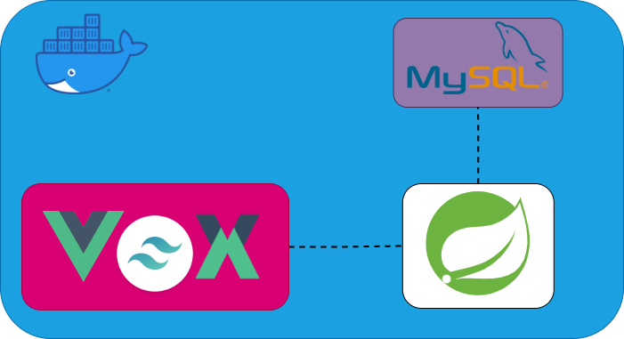
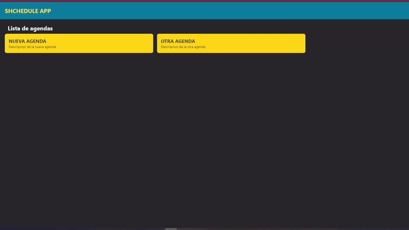

# Schedule App

## Arquitectura

## Demo

### Enlace
Ver 
[Demo](http://3.23.112.184)

### Health check

`{{API_URL}}:8080/actuator/health`

## Despliegue
### Despliegue de la aplicación
`docker-compose -f docker-compose.prod.yml up -d`

### Despliegue de la aplicación y reconstrucción de imágen
`docker-compose -f docker-compose.prod.yml up -d --build`

### Despliegue de Portainer para monitorear contenedores
`docker-compose -f docker-compose.portainer.yml up -d`

## Limpieza
### Eliminar imágenes y volumenes
`docker system prune`

### Eliminar imágenes, volumenes y caché
`docker system prune -a`